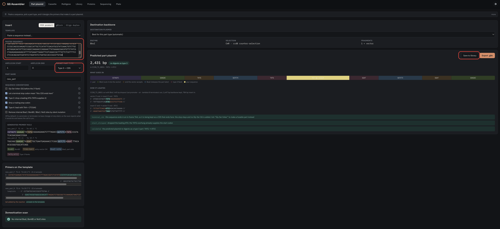
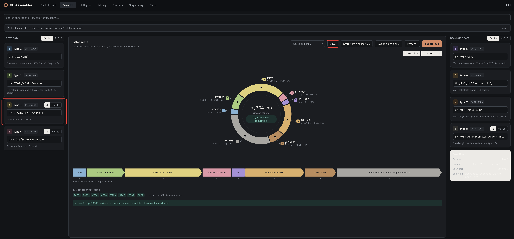
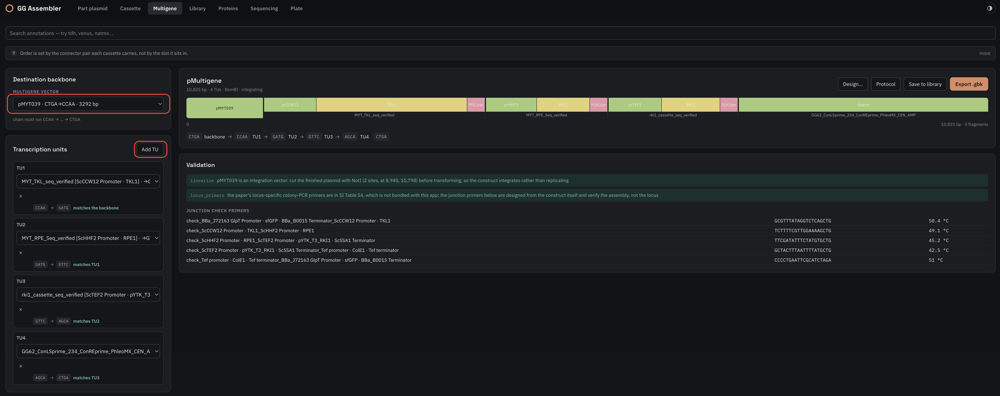
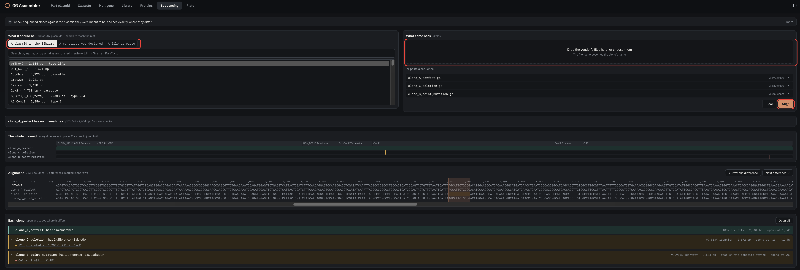

# Using GG Assembler

Nine things, in the order you will need them. Each one is the shortest version
that works; open the fold under it when you want to know why, or when the short
version is not enough.

1. [Install the app](#1-install-the-app)
2. [Get a plasmid library](#2-get-a-plasmid-library)
3. [Start the app](#3-start-the-app)
4. [Share your lab's library](#4-share-your-labs-library)
5. [Add new plasmids](#5-add-new-plasmids)
6. [Save and export what you build](#6-save-and-export-what-you-build)
7. [Build a part plasmid](#7-build-a-part-plasmid)
8. [Build an eight-part cassette](#8-build-an-eight-part-cassette)
9. [Build a multi-TU plasmid](#9-build-a-multi-tu-plasmid)
10. [Check a sequencing result](#10-check-a-sequencing-result)

---

## 1. Install the app

If your lab works in conda, use the environment file — it pins the Python
version and brings `git`, which the app needs for sharing a library and which
pip will not install for you:

```sh
conda env create -f https://raw.githubusercontent.com/Thatguy027/ggassembler/main/environment.yml
conda activate ggassembler
```

Otherwise, one line:

```sh
uv tool install ggassembler
```

Check it worked:

```sh
ggasm --help
```

<details>
<summary>Which to pick, what the prerequisites actually are, and upgrading</summary>

**Prerequisites** are only two, and the conda file supplies both:

| | | |
|---|---|---|
| Python 3.11+ | required | `uv` and conda both install it for you |
| `git` | for sharing only | already on macOS and most Linux; the app says so if it is missing, and everything else keeps working |

**Which route.** conda if your lab already standardises on it, or if you want
the environment pinned and reproducible. `uv` if you just want the app — it is
one line and installs its own Python.

If you have cloned the repository you can use the local file instead of the
URL: `conda env create -f environment.yml`. `mamba env create -f
environment.yml` is the same thing, faster.

**Without either:**

```sh
pipx install ggassembler          # or
pip install ggassembler           # inside a virtualenv
```

**If you have both**, a `uv tool install` on your PATH will shadow the one in
an activated conda environment — `which ggasm` says which you are running, and
they are separate installs that upgrade separately.

**If `ggasm` is not found afterwards**, check it installed at all — `uv tool
list` should name `ggassembler`, or `conda list ggassembler` inside the
environment. zsh also caches which commands exist, so a shell that failed once
keeps failing: run `rehash` or open a new terminal.

**Upgrading:** `uv tool upgrade ggassembler`, or `pip install -U ggassembler`
inside the conda environment.
</details>

---

## 2. Get a plasmid library

The app does not ship with plasmids. It reads a folder of GenBank files, and
you need one before anything else is useful.

```sh
ggasm init ytk --starter
```

That clones the published YTK and MYT kits — 192 records, enough to build a
complete cassette.

<details>
<summary>Joining a lab that has its own library</summary>

```sh
ggasm init plasmids --from git@github.com:<org>/<library>.git
```

This is the usual case once you are in a lab. It clones the repository, tells
git to ignore the index and merge the build log, and records a baseline if
there is not one.

If it stops with a message about access, you have no key on your GitHub account
or no access to that repository. `gh auth login` sets the first up; the second
is a conversation with whoever runs the library.
</details>

<details>
<summary>Already have a folder of GenBank files</summary>

Nothing to clone. Point the app at it directly in step 3. Files may be `.gb` or
`.gbk`, in one folder or nested — names and annotations are ignored, because
what each plasmid *is* gets decided by simulating the digest.

To make an existing folder shareable later: `ggasm init /path/to/folder`.
</details>

---

## 3. Start the app

```sh
ggasm serve ytk
```

It opens in your browser. Leave the terminal running — closing it stops the app.
Press `Ctrl-C` there when you are finished.

Which folder you serve decides everything downstream — what you can pick from,
and where anything you save ends up:

```sh
ggasm serve ~/lab      # your lab's library: everything, and saves go here
ggasm serve ~/ytk      # the published kits only: read-only, nothing saves here
```

<details>
<summary>Running more than one, several libraries at once, ports and options</summary>

**Two instances at the same time** need different ports, because the second one
would otherwise find 8737 taken:

```sh
ggasm serve ~/lab                 # http://127.0.0.1:8737
ggasm serve ~/ytk --port 8738     # http://127.0.0.1:8738
```

Each is a separate app on its own library. Keep the terminals apart, because
the window tells you nothing about which is which beyond the library named in
its header.

If a start fails with `address already in use`, an older server still holds the
port — **and the page in your browser is that one**, serving whatever library it
was started with. `pkill -f 'ggasm serve'` ends it.

A public base library and your lab's own scan as a single library:

```sh
ggasm serve ~/ggasm/ytk ~/ggasm/mylab --cache-dir ~/.ggasm
```

`--cache-dir` matters when the folders are far apart: without it the index
lands in whatever parent directory they happen to share.

| | |
|---|---|
| `--port 9000` | if 8737 is taken |
| `--no-browser` | do not open a tab |
| `--reload` | restart on `.py` changes — only useful if you are editing the app |

It serves on `http://127.0.0.1:8737`, which means *this machine*. Nobody else
can reach it, and nothing is uploaded anywhere.

The first start indexes every file and prints how many it found. Later starts
re-read only what changed.
</details>

---

## 4. Share your lab's library

Open the **Library** tab. Sharing is on by default.

Saving a plasmid on any screen publishes it to your lab. **Sync now** pulls in
what colleagues have added.

<details>
<summary>What the toggle does, and what it does not</summary>

**Share my plasmids with the lab** controls publishing only. Switch it off and
your plasmids stay on this machine — but you still receive everyone else's,
because working against a library you know is stale is how an assembly gets
repeated.

The setting is yours alone. It lives in `.ggasm/` beside the library, which is
never shared, so switching it off does not switch it off for the lab.

Before anything is published it is checked: a plasmid that will not digest, or
one nothing can classify, is refused rather than pushed. Problems the library
already had never block you — only ones your change introduces.

Sharing is git. Your library folder is a repository, and one private repository
per lab is what keeps one lab's plasmids out of another's.
</details>

---

## 5. Add new plasmids

Copy the `.gb` or `.gbk` files into your library folder, then press **Re-scan**
on the Library screen.

They are available immediately, and still there next time you start the app.

<details>
<summary>They are there but not usable, or classified wrongly</summary>

Everything is decided by the digest, so a file whose name says `promoter` and
whose sequence says otherwise is listed as what it is. Rows needing a human are
flagged amber: a conflict between digest and annotations, an internal site, or
nothing the digest could call.

Click the type pill on any row to assign a type by hand. Manual assignments beat
detection, are stored one file per plasmid under `ggasm/overrides/`, and are
shared with your lab alongside the plasmid itself.

Re-scan reads only files whose timestamp or size changed, so it stays quick on a
library of several hundred.

Plasmids saved from inside the app land in the library folder on their own — no
copying needed.
</details>

---

## 6. Save and export what you build

Every screen that builds something offers the same two buttons, and they do
different things.

**Save** writes the construct into your library and keeps it. **Export .gbk**
downloads the file and changes nothing.

| | Save | Export .gbk |
|---|---|---|
| writes a `.gb` into your library folder | yes | no |
| appears in dropdowns immediately | yes | no |
| still there next launch | yes | no |
| pushed to your lab | yes, if sharing is on | no |
| you get a file in Downloads | no | yes |
| checkable against a sequencing result later | yes, as a library plasmid | yes, as *a construct you designed* |

Use **Export** for something you want to open in SnapGene or send to a vendor.
Use **Save** for something you are actually going to build.

**Save to library** asks what to call it before writing anything, so the name
is decided once, deliberately, and is the filename on disk.

> **Export is the orange button and Save is not**, which makes Export look like
> the main action. If you meant to add a construct to your library and it is not
> there, this is why. Exporting leaves no `.gb` in the library — it downloads
> one and records the predicted sequence under `ggasm/expected/`.

> **Saves land in the first folder you served.** `ggasm serve ~/lab` saves into
> `~/lab`. Serve several folders and the first one wins — so put the library
> you work in first.

<details>
<summary>Where the file goes, what it is named, and undoing a save</summary>

The file is `<construct name>.gb` in the first library folder, so the name you
type in the app is the name on disk. Saving twice with the same name overwrites.

It is a plasmid like any other from that moment: it gets digested, typed and
listed alongside everything else, and a cassette you saved can be used as a
part of a multigene construct straight away.

Either way you can check a clone against it weeks later, but by different
routes. A **saved** construct is in the library, so the Sequencing screen finds
it under **A plasmid in the library**. An **exported** one is not, so the app
keeps its predicted sequence under `ggasm/expected/` and offers it under **A
construct you designed**.

Three other things are recorded as you work, all under `ggasm/` and all shared
with your lab:

| | |
|---|---|
| `ggasm/designs/` | the choices behind a design, so **Saved designs…** can reopen it |
| `ggasm/expected/` | the predicted sequence of anything exported |
| `ggasm/builds.jsonl` | one line per build: what was made, from what, how long |

A design is not a plasmid. Saving a design keeps the eight choices; it does not
put a construct in your library.

**To undo one**, delete the `.gb` from the library folder and press **Re-scan**.
If it was already shared, it is in your lab's git history too, so remove it
there as well: `git rm <name>.gb && git commit && git push` from the library
folder.

**Starter libraries refuse to be saved into.** A library cloned with
`--starter` is the published kit everyone shares, so publishing into it is
blocked outright rather than quietly pushing your construct to a public
repository.
</details>

## 7. Build a part plasmid

**Part plasmid** tab. Paste a sequence, pick what it should become, save.



1. Paste your sequence into **PASTED SEQUENCE**
2. **TARGET PART TYPE** — Type 3 for a CDS, 2 for a promoter, 4 for a terminator
3. Give it a **PART NAME**
4. **Save to library**

It designs the primers that add the right ends and shows them on the template,
with the predicted plasmid, what goes into it and how it ligates on the right.
The blue notes are it telling you what it did — above, that it kept a terminal
TAA, dropped a leading ATG because the TATG overhang supplies one, and confirmed
the result re-digests as `TATG → ATCC`.

<details>
<summary>Sequence conventions, and when to change them</summary>

The checkboxes under **Sequence conventions** decide what gets added or removed
at the ends. Each has an ⓘ explaining what it does and when it matters. The ones
that catch people out:

- **Type 3: drop a leading ATG** — the TATG overhang already supplies it, so a
  CDS pasted with its own ATG would otherwise get two.
- **Strip a trailing stop codon** — needed if anything is fused downstream.
- **Type 4: lead with TAA + CTCGAG** — supplies the stop a Type 3 part had
  removed.
- **Gly-Ser linker** — off by default. Only for a fusion where the two halves
  need spacing.

**Removing internal sites** is offered, never assumed. On a promoter or
terminator it is often unclear which change is safe, and that is your call, not
the app's.

**DESTINATION PLASMID** picks what the part lands in; left on *Best for this
part type (automatic)* it chooses for you. **Export .gbk** gives you the file
without adding it to the library.

**Insert** at the top switches between **PCR product**, **gBlock** and **Oligo
duplex** — the primers it designs depend on which, and an oligo duplex gets
annealed oligos instead.
</details>

---

## 8. Build an eight-part cassette

**Cassette** tab. It opens on a worked assembly from your own library, so you
can see a complete design before changing anything.



1. Click a panel and pick a part — each offers only parts whose overhangs fit
   that position
2. Name the construct
3. **Save**

It writes `<name>.gb` into your library folder and publishes it to your lab —
see [Save and export](#6-save-and-export-what-you-build).

The ring map redraws as you go. If the assembly cannot close, it says which
junction is the problem rather than just failing.


<details>
<summary>Splitting positions, composite parts, and the other two directions</summary>

Panels carry a segmented toggle where the standard allows a split — `3 | 3a+3b`
on Type 3, the same on 4 and 8. Switch it and the single panel becomes two.
A `2·3·4` or `6·7·8` composite collapses three positions into one.

**Start from a cassette…** takes a construct you already have and fills the
panels in, ready to swap one part. The assembly consumed every BsaI site, so
this is not a digest — each library part's fragment is looked for in the
sequence and the ones that abut are chained together.

**Sweep a position…** builds the same design once per candidate — every
promoter in your library against a fixed CDS, say — and writes them all out.

**Protocol** gives the pipetting steps and volumes. **Direction** and
**Linear view** change how the map is drawn, not what is built.
</details>

---

## 9. Build a multi-TU plasmid

**Multigene** tab. Chain cassettes into one construct.



1. **Add TU** for each transcription unit, and pick a cassette for each
2. Choose a **multigene vector**
3. Name it, then **Save to library**

Order comes from the connector pair each cassette carries, not from the order
you added them.

<details>
<summary>Designing from the other end, when you do not have the cassettes yet</summary>

**Design…** works backwards, which is the direction a project actually starts
from: say what you want expressed, in order, and it tells you the eight-part
plasmids to build first.

Give it a promoter, a coding sequence and a terminator per unit, pick a
destination backbone, and press **Work it out**. **Download all** writes them.

**It assigns the connectors for you**, so the cassettes chain in the order of
the rows — three units come out `ConLS → ConR1`, `ConL1 → ConR2`,
`ConL2 → ConRE`. They come from the backbone's own ends, so a different
destination gives a different chain. Positions 1 and 5 are not offered: they
*are* the order, and setting them separately would mean saying it twice.

**The cassette backbone — marker, yeast origin, E. coli backbone — is yours to
choose**, once for the whole design, with an override on any unit. A marker
usually differs per unit, since each one integrates at a different locus;
origin and backbone rarely do. Left on *Choose for me* it takes the simplest
usable part, which is what it always did.

If a backbone cannot work it says which part is missing — *"nothing in the
library ends a unit at CTGA (ConLS) … you would need a type 5 part releasing
CTGA"*. For the multi-round pMYT destinations that is usually a ConLS′ or
ConRE′ connector, which the kit supplies only on one side, so a library built
from parts alone will not have one until you add it.

**Protocol** gives the assembly steps for the BsmBI reaction.
</details>

---

## 10. Check a sequencing result

**Sequencing** tab. Compare clones a vendor sent back against what they should
have been.



1. Pick the reference — **A plasmid in the library**, **A construct you
   designed**, or **A file or paste**
2. Drop the vendor's files into **What came back** — the file name becomes the
   clone's name
3. **Align**

Each clone gets a verdict with a scrollable alignment below it. Above, one clone
matches, one has a 12 bp deletion in CamR, and one has a single C→A in ColE1 and
was read on the opposite strand — which the app worked out rather than reporting
as a rearrangement.

<details>
<summary>Whole-plasmid reads, and reading the alignment</summary>

Built for whole-plasmid nanopore results, where the clone starts at an arbitrary
position and may be the reverse complement. It finds where the two circles
correspond and opens them at the same place, so a rotated read does not look
like a rearrangement.

**Next difference →** and **← Previous difference** jump between mismatches.
**Open all** expands every clone's detail at once.

Differences are listed below the alignment, folded, so a clone with forty
mismatches does not bury one with a single mismatch.

A long stretch the app will not align base by base is shown grey and labelled,
rather than painted as thousands of mismatches.

A construct you saved from the Cassette or Multigene screen is available as
**A construct you designed** — the predicted sequence is kept precisely so that
sequencing it later has something to check against.
</details>

---

## When something is wrong

| | |
|---|---|
| `ggasm: command not found` | first check it is actually installed: `uv tool list` should name `ggassembler`. If it is there, zsh has cached the miss — run `rehash` or open a new terminal. Only if it is still missing is PATH the problem: `uv tool update-shell` |
| `not a folder: ytk` | the library has not been created yet — `ggasm init ytk --starter` |
| The page will not load | the terminal running `ggasm serve` has stopped; start it again |
| `address already in use` | an older `ggasm serve` still holds the port — and the app in your browser is **that** one, serving whatever library it was started with. `pkill -f 'ggasm serve'`, then start again, or pass `--port` |
| A plasmid is missing | **Re-scan** on the Library screen; if still missing, it is not a GenBank file the app could read |
| A part is not offered | its overhangs do not fit that position — the Library screen says what it was detected as |
| I built something but cannot find it | you probably pressed **Export .gbk** (orange) rather than **Save**. Export downloads a file and adds nothing to the library. Reopen the design from **Saved designs…** and press Save |
| It saved under the wrong name | the save asks for one, so answer it rather than accepting the default. To remove a mistake there is no control in the app: delete the `.gb` from the library folder, press **Re-scan**, and if it was shared, `git rm`/`commit`/`push` from that folder too |
| Sharing says it cannot reach GitHub | `ssh -T git@github.com` to check access, `gh auth login` to set it up |
| Changes to the app's code do nothing | restart `ggasm serve`, or run it with `--reload` |
